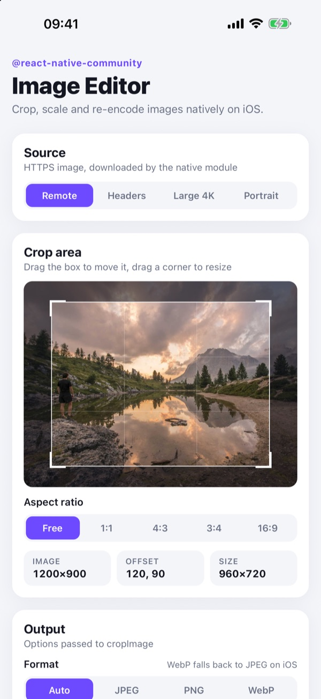
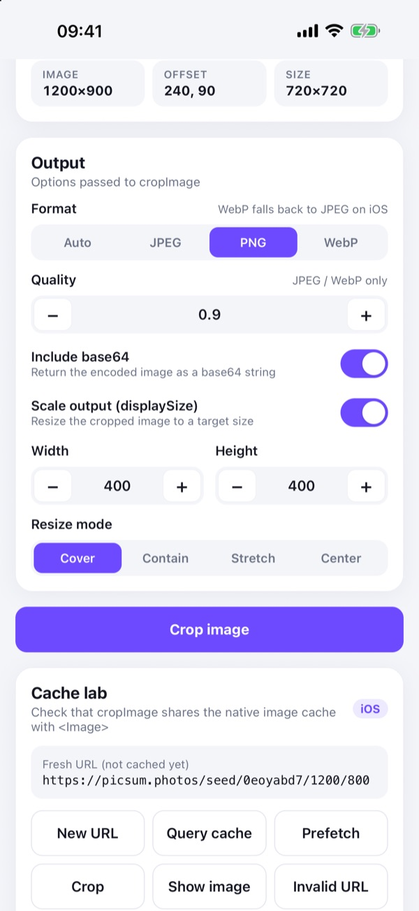
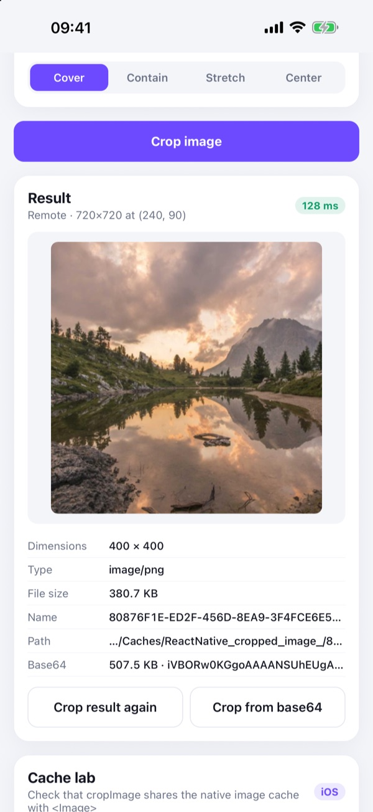
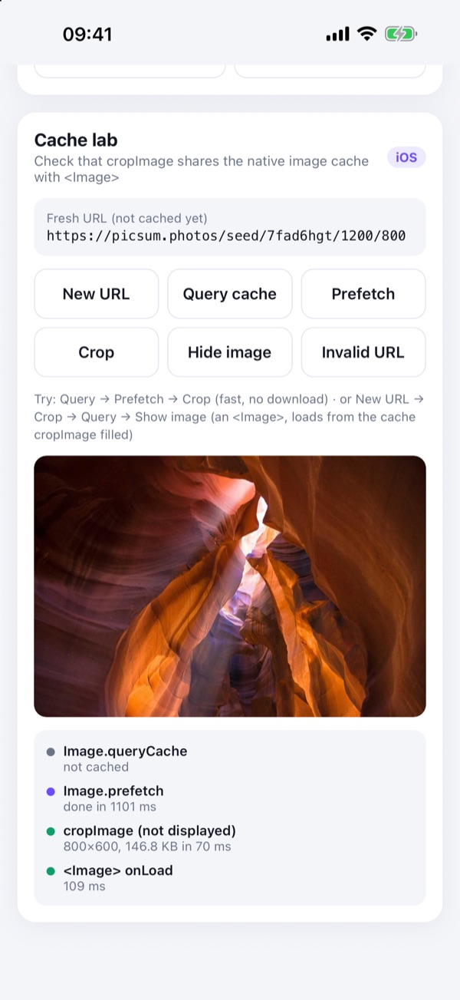

# Image Editor example app

A playground for [`@react-native-community/image-editor`](../README.md) that exercises every option of `ImageEditor.cropImage`.

> [!NOTE]
> The UI in this app (crop box, controls, result inspector, cache lab) is **not part of the library**. The library only provides `ImageEditor.cropImage()`. The UI is plain React Native code you're free to copy.

| Editor | Output options | Result | Cache lab |
| :---: | :---: | :---: | :---: |
|  |  |  |  |

## What it covers

- **Sources**: a remote URL, a remote URL with custom `headers`, a 4000×3000 image, a portrait image, the previous result as a `file://` URI, and the previous result's base64 as a `data:` URI.
- **Crop area**: drag the box to move it and its corners to resize it, with aspect ratio presets (Free, 1:1, 4:3, 3:4, 16:9). Offset and size are shown in the original image's pixels, which is what `cropImage` expects.
- **Output options**: `format`, `quality`, `includeBase64`, `displaySize` and `resizeMode`.
- **Result**: preview, dimensions, MIME type, file size, path, base64 preview and the time `cropImage` took.
- **Cache lab**: `Image.queryCache`, `Image.prefetch`, cropping a URL without displaying it, rendering it with `<Image>`, and an invalid URL to check that the promise rejects. Use it to check that `cropImage` reuses the image already cached by `Image.prefetch` / `<Image>`.

Platform differences are labeled in the UI: iOS writes only JPEG or PNG (`webp` falls back to JPEG), and Android ignores `resizeMode`.

## Running

The app links the library from the repository root (`"@react-native-community/image-editor": "link:.."`), so changes to `../src`, `../ios` and `../android` are picked up directly. Metro watches the root folder (see [`metro.config.js`](./metro.config.js)).

```sh
cd example
yarn install
```

### iOS

```sh
cd ios && bundle install && bundle exec pod install && cd ..
yarn ios
```

### Android

```sh
yarn android
```

Metro starts automatically. To start it yourself, run `yarn start`.

## Code map

| File | What it does |
| --- | --- |
| [`src/App.tsx`](./src/App.tsx) | Screen state and the `ImageEditor.cropImage` call |
| [`src/components/CropArea.tsx`](./src/components/CropArea.tsx) | Image with a draggable, resizable crop box (`PanResponder`) |
| [`src/components/ResultCard.tsx`](./src/components/ResultCard.tsx) | Shows the `CropResult` |
| [`src/components/CacheLab.tsx`](./src/components/CacheLab.tsx) | Prefetch / cache checks |
| [`src/components/ui.tsx`](./src/components/ui.tsx) | Small UI kit (section, segmented control, toggle, stepper, button) |
| [`src/sources.ts`](./src/sources.ts) | Sample image URLs |
